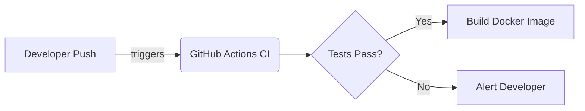

# Code Quality Analyzer Dashboard

A **full-stack modern developer tool** designed to demonstrate core DevOps principles, including Continuous Integration, Docker containerization, and modern deployment practices.


---

## 🚀 Project Overview

The **Code Quality Analyzer Dashboard** allows users to drag-and-drop a code file (`.js`, `.ts`, `.py`) to instantly extract code metrics such as:
- Total lines of code
- Number of functions
- Number of comments
- Number of blank lines
- Estimated Complexity Score

The frontend is a beautifully designed, modern SaaS-like dashboard featuring a dark theme, neon glowing accents, glassmorphism panels, interactive Chart.js graphs, and simulated terminal animations.

### Tech Stack
- **Frontend**: HTML5, CSS3, Vanilla JS, Chart.js, FontAwesome
- **Backend**: Node.js, Express.js, Multer
- **DevOps**: Docker, Docker Compose, GitHub Actions, Git

---

## 🏗️ DevOps Workflows Demonstrated

This project is built specifically to highlight modern DevOps workflows for classroom demonstration:

1. **Version Control**: Tracked using Git/GitHub.
2. **Containerization**: Packaged with a highly optimized `node:18-alpine` Dockerfile.
3. **Orchestration**: Managed locally via Docker Compose for easy spin-up.
4. **Continuous Integration**: Automated GitHub Actions `.github/workflows/ci.yml` pipeline that triggers on push/PR to verify dependencies and validate the Docker build.

### DevOps Workflow Diagram


---

## 💻 How to Run Locally (Without Docker)

1. Ensure you have Node.js installed on your machine.
2. Clone this repository and navigate to the project directory:
   ```bash
   cd code-quality-analyzer
   ```
3. Install dependencies:
   ```bash
   npm install
   ```
4. Start the server:
   ```bash
   node backend/server.js
   ```
5. Open your browser and navigate to `http://localhost:3000`.

---

## 🐳 How to Run with Docker

1. Ensure Docker Desktop is running.
2. Use Docker Compose to build and start the container:
   ```bash
   docker-compose up -d --build
   ```
3. The app is now accessible at `http://localhost:3000`.
4. To stop the container, run:
   ```bash
   docker-compose down
   ```

---

## 👨‍💻 CI Pipeline Explanation

The project includes a `.github/workflows/ci.yml` file that automates the testing and build phase.
When code is pushed to the `main` branch, GitHub Actions provisions an Ubuntu runner to:
1. Checked out the repository.
2. Setup the Node.js v18 environment.
3. Install all npm dependencies (verifying package integrity).
4. Run a simulated test suite.
5. Build the Docker container to ensure the image compiles successfully based on the newest commit.

---
_Built for DevOps Education & Demonstration_

 hello
